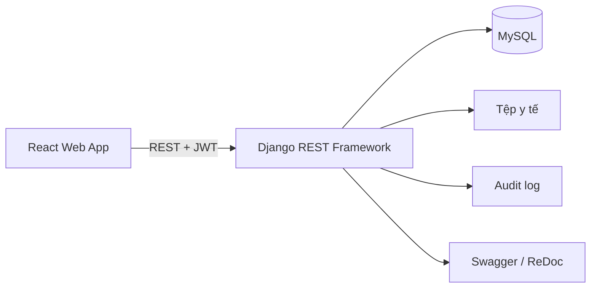

# EMR Care

Hệ thống quản lý bệnh án điện tử cho quy trình khám ngoại trú, kết nối công việc của nhân viên tiếp nhận, điều dưỡng, bác sĩ, nhân viên xét nghiệm và quản trị viên trên một nền tảng Web.

**Demo:** [https://emr-care.site](https://emr-care.site) · Môi trường trình diễn chạy qua Cloudflare Tunnel và chỉ truy cập được khi máy chủ demo đang hoạt động.

> EMR Care là sản phẩm học tập và trình diễn đồ án. Hệ thống sử dụng dữ liệu giả lập, chưa được đánh giá để thay thế bệnh án giấy hoặc vận hành với dữ liệu y tế thật.

## Bài toán và giải pháp

Trong quy trình khám ngoại trú, dữ liệu của một bệnh nhân được tạo và cập nhật qua nhiều bộ phận. Nếu mỗi bộ phận quản lý dữ liệu riêng, thông tin dễ bị trùng lặp, thiếu liên kết và khó truy vết.

EMR Care tổ chức dữ liệu theo một luồng thống nhất:

```text
Tiếp nhận → Đo sinh hiệu → Khám bác sĩ → Xét nghiệm/Kê đơn → Hoàn tất → Tra cứu lịch sử
```

Hồ sơ bệnh án giữ liên kết giữa thông tin bệnh nhân, các lần đến khám, lượt khám chuyên khoa, sinh hiệu, chẩn đoán, đơn thuốc, xét nghiệm và tệp đính kèm.



## Điểm nổi bật kỹ thuật

- Xác thực bằng JWT, tự làm mới access token và phân quyền API theo 5 vai trò.
- Quản lý quy trình khám bằng trạng thái nghiệp vụ để hạn chế thao tác sai thứ tự.
- Xây dựng ba hàng đợi từ dữ liệu trong MySQL: đo sinh hiệu, khám bệnh và xét nghiệm.
- Sử dụng transaction và `select_for_update()` tại các thao tác đổi trạng thái quan trọng để giảm nguy cơ xử lý trùng.
- Lưu nhật ký thao tác kèm người thực hiện, hành động, đối tượng liên quan và thời gian.
- Quản lý tệp y tế có kiểm soát quyền: bác sĩ bổ sung tài liệu cho lượt khám, nhân viên xét nghiệm tải tệp kết quả cho chỉ định đang xử lý.
- Tách frontend và backend qua REST API; cung cấp tài liệu tương tác bằng Swagger và ReDoc.
- Hỗ trợ dữ liệu mẫu có thể tái tạo để kiểm thử và trình diễn toàn bộ quy trình.

## Phạm vi thực hiện

Đây là dự án cá nhân full-stack. Các phần chính được thực hiện gồm phân tích luồng nghiệp vụ, thiết kế mô hình dữ liệu và trạng thái, xây dựng REST API và giao diện theo vai trò, phân quyền, kiểm thử tự động, tạo dữ liệu mô phỏng và triển khai bản demo.

## Chức năng theo vai trò

| Vai trò | Chức năng chính |
|---|---|
| Quản trị viên | Quản lý tài khoản, nhân viên, khoa, thuốc, danh mục xét nghiệm, báo cáo và audit log |
| Nhân viên tiếp nhận | Tra cứu hoặc tạo bệnh nhân, tạo lần đến khám và lượt khám ban đầu |
| Điều dưỡng | Theo dõi hàng đợi, đo và cập nhật dấu hiệu sinh tồn |
| Bác sĩ | Xem bệnh án, khám, chẩn đoán, kê đơn, chỉ định xét nghiệm, chuyển khoa và quản lý tài liệu của lượt khám |
| Nhân viên xét nghiệm | Tiếp nhận chỉ định, cập nhật tiến độ, nhập nội dung và tải tệp kết quả xét nghiệm |

## Công nghệ

| Thành phần | Công nghệ |
|---|---|
| Frontend | React 19, React Router 7, Vite 8, CSS |
| Backend | Python, Django 6, Django REST Framework |
| Cơ sở dữ liệu | MySQL 8, PyMySQL |
| Xác thực | Simple JWT |
| Tài liệu API | drf-yasg, Swagger UI, ReDoc |
| Triển khai demo | Cloudflare Tunnel, domain `emr-care.site` |

## Kiểm thử và kiểm tra chất lượng

- **26 kiểm thử API tự động** bằng `APITestCase`, bao phủ RBAC, trạng thái nhân viên, tiếp nhận, sinh hiệu, khám bệnh, xét nghiệm, đơn thuốc, chuyển chuyên khoa, tệp đính kèm và audit log.
- Backend được kiểm tra bằng Django system check và chạy trên database kiểm thử độc lập.
- Frontend được kiểm tra bằng ESLint và production build của Vite.

```powershell
cd backend
python manage.py test emrapi -v 2
python manage.py check

cd ..\frontend
npm run lint
npm run build
```

## Chạy dự án trên máy local

### Yêu cầu

- Git.
- Python 3.12 trở lên.
- Node.js 20.19 trở lên hoặc 22.12 trở lên.
- MySQL 8.

Phiên bản hiện tại chạy trực tiếp trên máy và không yêu cầu Docker.

### 1. Clone repository

```powershell
git clone https://github.com/vinhhungpug745/EMR.git
cd EMR
```

### 2. Tạo database

Chạy trong MySQL:

```sql
CREATE DATABASE emr_db
  CHARACTER SET utf8mb4
  COLLATE utf8mb4_unicode_ci;
```

### 3. Cấu hình backend

```powershell
cd backend
python -m venv .venv
.\.venv\Scripts\Activate.ps1
python -m pip install --upgrade pip
pip install -r requirements.txt
```

Nếu PowerShell chặn script kích hoạt môi trường ảo:

```powershell
Set-ExecutionPolicy -Scope Process -ExecutionPolicy Bypass
.\.venv\Scripts\Activate.ps1
```

Tạo file `backend/.env`:

```dotenv
DEBUG=True
SECRET_KEY=thay-bang-mot-chuoi-bi-mat-dai-va-ngau-nhien
DB_ENGINE=django.db.backends.mysql
DB_NAME=emr_db
DB_USER=root
DB_PASSWORD=mat-khau-mysql-cua-ban
DB_HOST=127.0.0.1
DB_PORT=3306
```

Không commit `.env` hoặc thông tin đăng nhập thật lên GitHub.

Khởi tạo database và nạp dữ liệu trình diễn:

```powershell
python manage.py migrate
python seed.py
python manage.py runserver 8000
```

Backend chạy tại `http://127.0.0.1:8000`.

### 4. Cấu hình frontend

Mở terminal mới tại thư mục gốc:

```powershell
cd frontend
npm install
npm run dev
```

Truy cập `http://localhost:3000`. Với cấu hình local mặc định, frontend không cần file `.env` riêng.

Khi frontend và backend chạy trên hai địa chỉ khác nhau, tạo `frontend/.env`:

```dotenv
VITE_API_BASE_URL=https://dia-chi-backend-cua-ban
```

Khởi động lại Vite sau khi thay đổi biến môi trường.

## Tài khoản demo

Chạy `python seed.py` để tạo dữ liệu giả lập.

| Vai trò | Tên đăng nhập |
|---|---|
| Quản trị viên | `admin_emr` |
| Nhân viên tiếp nhận | `tiepnhan.mai` |
| Điều dưỡng | `dieuduong.lan` |
| Bác sĩ | `bacsi.an` |
| Nhân viên xét nghiệm | `xetnghiem.hai` |

Mật khẩu chung sau khi chạy seed: `Emr@123456`.

Không sử dụng các tài khoản hoặc mật khẩu demo trong môi trường thực tế.

## Kịch bản demo nhanh

1. Đăng nhập với vai trò tiếp nhận, tìm hoặc tạo bệnh nhân và tạo lần đến khám.
2. Đăng nhập với vai trò điều dưỡng, chọn bệnh nhân trong hàng đợi và ghi sinh hiệu.
3. Đăng nhập với vai trò bác sĩ, mở lượt khám và nhập thông tin khám.
4. Tạo chỉ định xét nghiệm hoặc kê đơn thuốc.
5. Đăng nhập với vai trò xét nghiệm, tiếp nhận chỉ định, nhập nội dung hoặc tải tệp kết quả và hoàn tất xét nghiệm.
6. Quay lại vai trò bác sĩ, xem nội dung/tệp kết quả và hoàn tất lượt khám.
7. Dùng tài khoản quản trị để xem báo cáo và nhật ký thao tác.

## Tài liệu API

Khi backend đang chạy:

- Swagger UI: [http://127.0.0.1:8000/swagger/](http://127.0.0.1:8000/swagger/)
- ReDoc: [http://127.0.0.1:8000/redoc/](http://127.0.0.1:8000/redoc/)
- Django Admin: [http://127.0.0.1:8000/admin/](http://127.0.0.1:8000/admin/)


## Cấu trúc repository

```text
EMR/
├── backend/
│   ├── config/          # Cấu hình Django
│   ├── emrapi/          # Models, serializers, views, permissions và tests
│   ├── seed.py          # Tạo dữ liệu trình diễn
│   └── requirements.txt
├── frontend/
│   ├── src/api/         # Lớp giao tiếp REST API
│   ├── src/auth/        # Xác thực và bảo vệ route
│   ├── src/components/  # Thành phần giao diện theo vai trò
│   └── src/pages/       # Các màn hình nghiệp vụ
└── README.md
```

## Giới hạn hiện tại

- Ba hàng đợi được đọc từ database theo trạng thái, thứ tự thời gian và tự động cập nhật bằng polling mỗi 15 giây; chưa sử dụng WebSocket hoặc Server-Sent Events.
- Môi trường demo phụ thuộc vào máy cá nhân chạy frontend, backend, MySQL và Cloudflare Tunnel.
- Chưa có cổng bệnh nhân, đặt lịch online, viện phí, bảo hiểm, nội trú hoặc thanh toán.
- Chưa tích hợp chữ ký số và chưa liên thông HIS, LIS hay nền tảng y tế quốc gia.
- Chưa đáp ứng đầy đủ các yêu cầu vận hành production như sao lưu tự động, giám sát, khả năng sẵn sàng cao và đánh giá bảo mật chuyên sâu.

## Tác giả

**vinhhungpug745** — Full-stack development

- GitHub: [github.com/vinhhungpug745](https://github.com/vinhhungpug745)
- Email: [vinhhungpug745@gmail.com](mailto:vinhhungpug745@gmail.com)

## License

Repository hiện chưa công bố giấy phép mã nguồn mở. Mọi quyền thuộc về tác giả.
